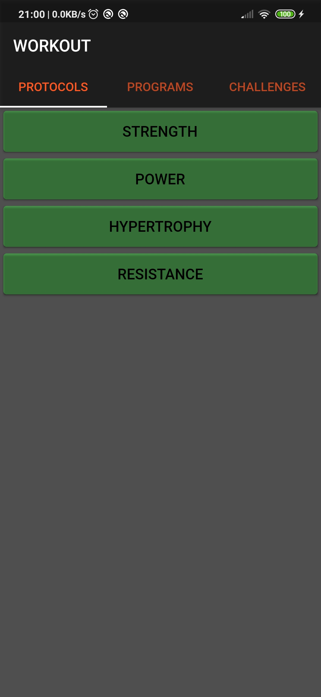

# WorkoutApp

A Flutter application that can help you with your workouts. You can choose which of the default protocols you want to train with or create your own protocols, without worrying too much about rest time, sets or reps, you have only to play and stop the timer as you like.

You can also create your programs and, once created, you can use them. The timer will automatically jump from one exercise to the other, your only worry is to play and stop the timer. 

## Code [here](lib)

## Screenshots

